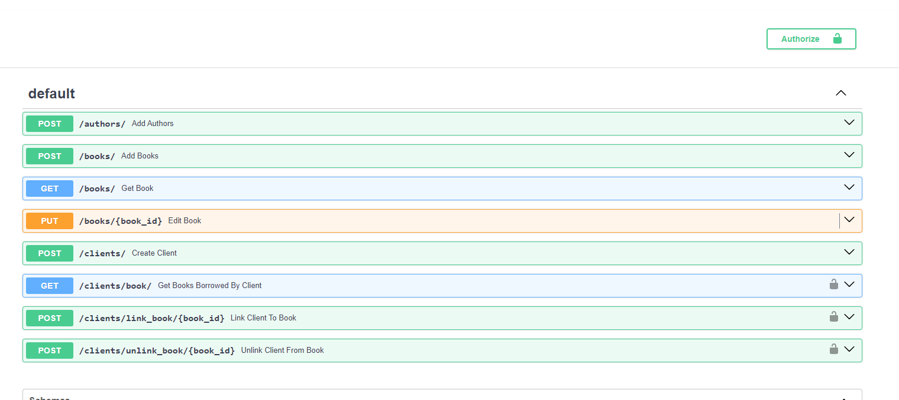
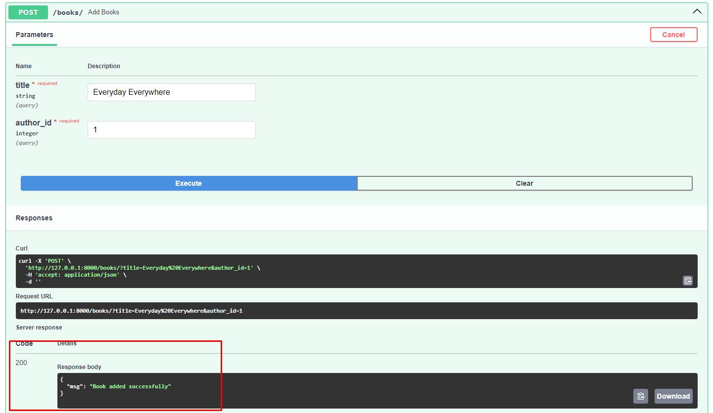

# Test for Python Developer (Machine Learning/AI)

# Task-2

**FastAPI**
Here I'm created API using FastAPI which is based on Python.
Book Service: Create a RESTful API for 'Book Service' where customer/client can borrowed book and return the book within a timeframe. Admin can add book and author.

<b>What I've done in this project:</b>
1. Add a Book
2. Edit Book title and Author
3. Add multiple books by same author.
4. Book list filtering by book name or first letter and author.
5. Create Author and Client.
6. Client can borrowed book and return. It will be enlisted in this app.
7. For Database I'm using postgreSQL.
8. After finish the project, I put it in Docker container.

<b>How to run the project:</b>
1. To run the project first you have to install venv by command 'python -m venv tenv'.
2. After that you have to run the 'venv' by command 'tenv\Scripts\activate' for WindowsOS and 'source tenv/bin/activate' for MacOS.
3. Then install the packages that in the 'requirements.txt' file. The command is 'pip install -r requirements.txt'.
4. Now run the server by the help of uvicorn. 'uvicorn main:app -reload'
5. After run the project, you'll see the API documentation at '127.0.0.1:8000/docs'

**Screenshots:**

API List

API response

<b>Thanks.....</b>
